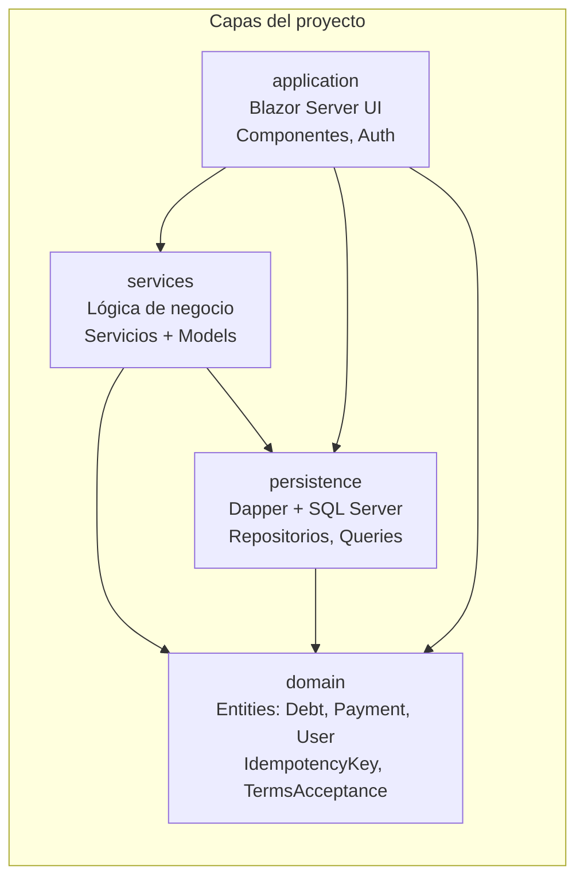
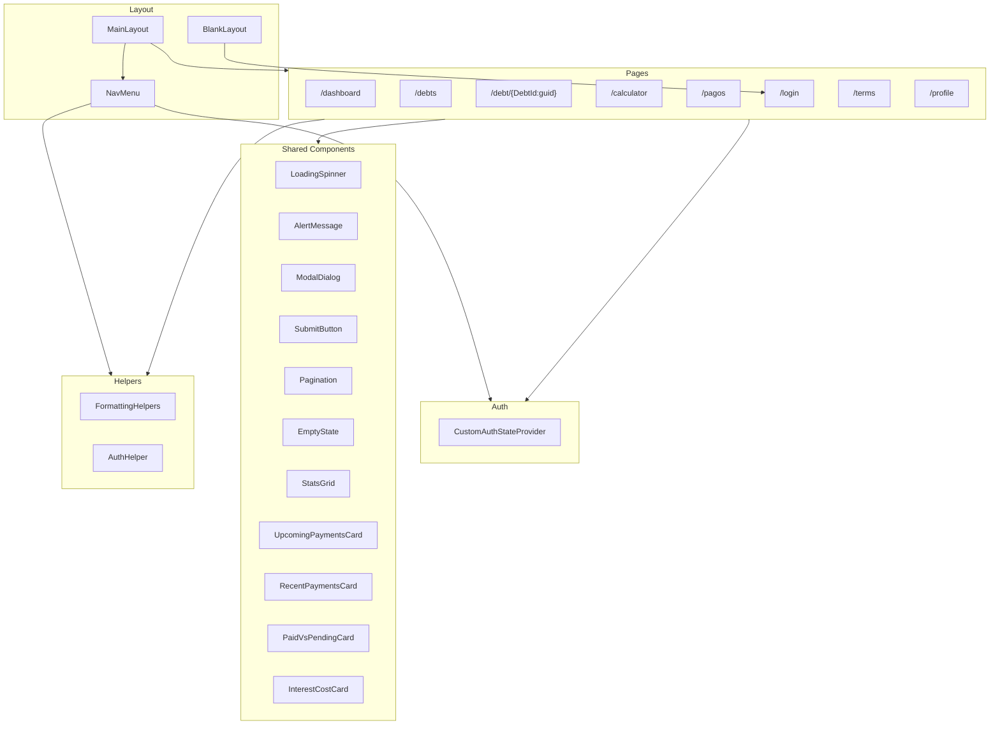
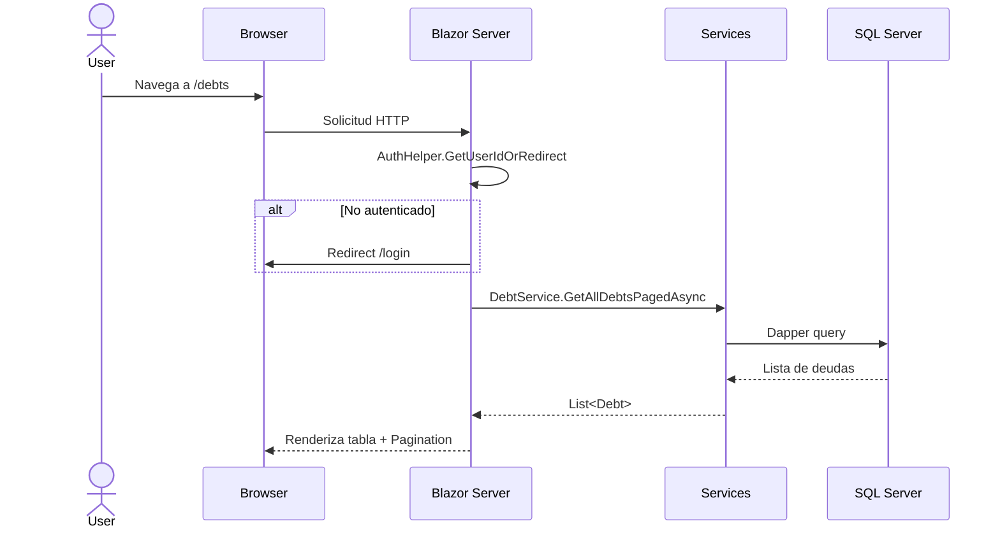
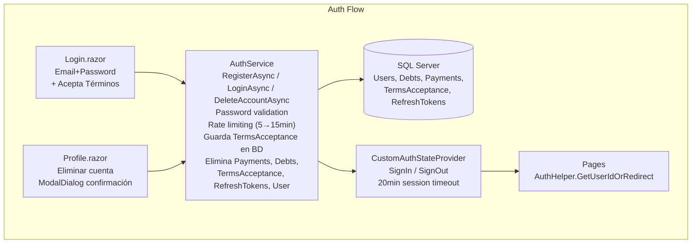

# Reglas
- Siempre preguntar antes de cambiar la lógica de negocio
- No agregar comentarios al código a menos que se solicite
- Mantener el código en español (UI) e inglés (código) según convención existente
- Cada vez que se modifique el código, revisar los diagramas Mermaid en este archivo y actualizarlos si los cambios afectan la arquitectura, dependencias, flujos o componentes representados

# Arquitectura del proyecto





```mermaid
flowchart LR
    subgraph UI["Blazor Pages"]
        DASH["Dashboard"]
        DEBTS["Debts"]
        DETAIL["DebtDetail"]
        CALC["Calculator"]
        PAGOS["Pagos"]
        PROFILE["Profile"]
    end

    subgraph Services["Services Layer"]
        DS["IDebtService"]
        PS["IPaymentService"]
        CS["ICalculatorService"]
        DBS["IDashboardService"]
        AS["IAuthService\nRegister / Login / Logout\nDeleteAccount"]
    end

    subgraph Data["Data Access"]
        DR["DebtRepository"]
        PR["PaymentRepository"]
        UR["UserRepository"]
        IR["IdempotencyRepository"]
        TR["TermsAcceptanceRepository"]
        RR["RefreshTokenRepository"]
    end

    subgraph DB[("SQL Server\nDebtManager_db")]
    end

    DASH --> DBS
    DASH --> PS
    DEBTS --> DS
    DEBTS --> PS
    DETAIL --> DS
    DETAIL --> PS
    DETAIL --> CS
    CALC --> CS
    CALC --> DS
    PAGOS --> DS
    PAGOS --> PS
    Login --> AS
    PROFILE --> AS

    DS --> DR
    PS --> PR
    DBS --> DR
    DBS --> PS
    AS --> UR
    AS --> TR
    AS --> DR
    AS --> PR
    AS --> RR

    DR --> DB
    PR --> DB
    UR --> DB
    IR --> DB
    TR --> DB
    RR --> DB
```




